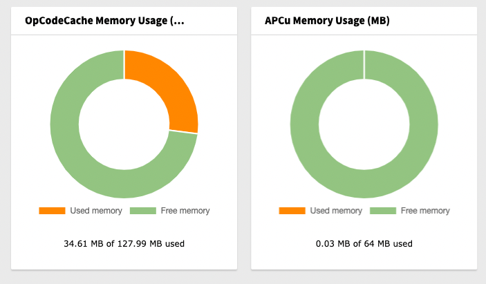

# Mittwald TYPO3 Extension ``mw_cache_widget``

## What does it do?

Mittwald Cache Widget is an extension for TYPO3 CMS to show the PHP OPCache and the APCu memory usage
in the TYPO3 dashboard.

## Screenshots

## Installation

1) Install the extension from the TYPO3 Extension Repository or using composer
2) Add one of the available Cache Widgets to the TYPO3 dashboard 

## Configuration

No configuration is required.

## TYPO3 Compatibility

| Version | TYPO3       | PHP       | Support/Development                  |
|---------|-------------|-----------|--------------------------------------|
| 3.x     | 12.4 - 13.4 | >= 8.1    | Features, Bugfixes, Security Updates |
| 2.x     | 11.5        | 7.4 - 8.x | Bugfixes, Security Updates           |
| 1.x     | 10.4        | 7.2 - 7.4 | Bugfixes, Security Updates           | 
